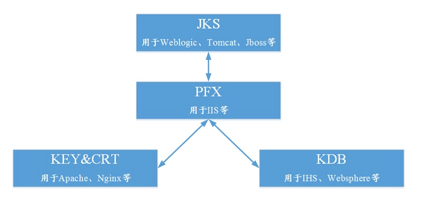

# 主流的证书格式：

.DER .CER，文件是二进制格式，只保存证书信息，不包含私钥。
.PEM，一般是文本格式，可保存证书，可保存私钥，或者两者都包含。 *.PEM如果只包含私钥，那一般用 *.KEY代替。
.CRT，可以是二进制格式，可以是文本格式，与 .DER 格式相同，不包含私钥key文件。
.PFX .P12，二进制格式，同时包含证书和私钥，一般有密码保护。
.JKS，二进制格式，同时包含证书和私钥，一般有密码保护。

这些证书格式之间是可以互相转换的：

我们产品配置https需要nginx支持的证书，不支持其他格式的证书

*.crt，*.key私钥文件

*.pem，*.key私钥文件，*.pem配置在产品的nginx中，不需要使用工具转换证书格式，只需要把后缀改为.crt挂载到docker-compose文件中即可。