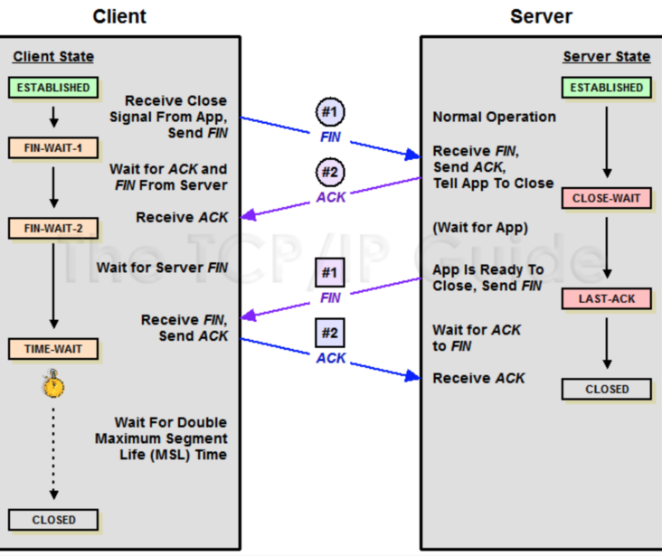

## 被动关闭（Server）的一方响应 ACK 包，此时，被动关闭的一方就进入了 CLOSE_WAIT 状态
https://segmentfault.com/a/1190000017313251?utm_source=tag-newest

发现绝大部份的链接处于 CLOSE_WAIT 状态，这是非常不可思议情况。然后用 netstat -an 命令进行了检查。

image-20181208172652155

图四：大量的CLOSE_WAIT

CLOSED 表示socket连接没被使用。
LISTENING 表示正在监听进入的连接。
SYN_SENT 表示正在试着建立连接。
SYN_RECEIVED 进行连接初始同步。
ESTABLISHED 表示连接已被建立。
CLOSE_WAIT 表示远程计算器关闭连接，正在等待socket连接的关闭。
FIN_WAIT_1 表示socket连接关闭，正在关闭连接。
CLOSING 先关闭本地socket连接，然后关闭远程socket连接，最后等待确认信息。
LAST_ACK 远程计算器关闭后，等待确认信号。
FIN_WAIT_2 socket连接关闭后，等待来自远程计算器的关闭信号。
TIME_WAIT 连接关闭后，等待远程计算器关闭重发。
然后开始重点思考为什么会出现大量的mysql连接是 CLOSE_WAIT 呢？为了说清楚，我们来插播一点TCP的四次挥手知识。

TCP四次挥手
我们来看看 TCP 的四次挥手是怎么样的流程：

图五：TCP四次挥手

用中文来描述下这个过程：

Client: 服务端大哥，我事情都干完了，准备撤了，这里对应的就是客户端发了一个FIN

Server：知道了，但是你等等我，我还要收收尾，这里对应的就是服务端收到 FIN 后回应的 ACK

经过上面两步之后，服务端就会处于 CLOSE_WAIT 状态。过了一段时间 Server 收尾完了

Server：小弟，哥哥我做完了，撤吧，服务端发送了FIN

Client：大哥，再见啊，这里是客户端对服务端的一个 ACK

到此服务端就可以跑路了，但是客户端还不行。为什么呢？客户端还必须等待 2MSL 个时间，这里为什么客户端还不能直接跑路呢？主要是为了防止发送出去的 ACK 服务端没有收到，服务端重发 FIN 再次来询问，如果客户端发完就跑路了，那么服务端重发的时候就没人理他了。这个等待的时间长度也很讲究。

Maximum Segment Lifetime 报文最大生存时间，它是任何报文在网络上存在的最长时间，超过这个时间报文将被丢弃
这里一定不要被图里的 client／server 和项目里的客户端服务器端混淆，你只要记住：主动关闭的一方发出 FIN 包（Client），被动关闭（Server）的一方响应 ACK 包，此时，被动关闭的一方就进入了 CLOSE_WAIT 状态。如果一切正常，稍后被动关闭的一方也会发出 FIN 包，然后迁移到 LAST_ACK 状态。

既然是这样， TCP 抓包分析下：

/go # tcpdump -n port 3306
# 发生了 3次握手
11:38:15.679863 IP 172.18.0.5.38822 > 172.18.0.3.3306: Flags [S], seq 4065722321, win 29200, options [mss 1460,sackOK,TS val 2997352 ecr 0,nop,wscale 7], length 0
11:38:15.679923 IP 172.18.0.3.3306 > 172.18.0.5.38822: Flags [S.], seq 780487619, ack 4065722322, win 28960, options [mss 1460,sackOK,TS val 2997352 ecr 2997352,nop,wscale 7], length 0
11:38:15.679936 IP 172.18.0.5.38822 > 172.18.0.3.3306: Flags [.], ack 1, win 229, options [nop,nop,TS val 2997352 ecr 2997352], length 0

# mysql 主动断开链接
11:38:45.693382 IP 172.18.0.3.3306 > 172.18.0.5.38822: Flags [F.], seq 123, ack 144, win 227, options [nop,nop,TS val 3000355 ecr 2997359], length 0 # MySQL负载均衡器发送fin包给我
11:38:45.740958 IP 172.18.0.5.38822 > 172.18.0.3.3306: Flags [.], ack 124, win 229, options [nop,nop,TS val 3000360 ecr 3000355], length 0 # 我回复ack给它

... ... # 本来还需要我发送fin给他，但是我没有发，所以出现了close_wait。那这是什么缘故呢？
src > dst: flags data-seqno ack window urgent options
src > dst 表明从源地址到目的地址
flags 是TCP包中的标志信息,S 是SYN标志, F(FIN), P(PUSH) , R(RST) "."(没有标记)
data-seqno 是数据包中的数据的顺序号
ack 是下次期望的顺序号
window 是接收缓存的窗口大小
urgent 表明数据包中是否有紧急指针
options 是选项

结合上面的信息，我用文字说明下：MySQL负载均衡器 给我的服务发送 FIN 包，我进行了响应，此时我进入了 CLOSE_WAIR 状态，但是后续作为被动关闭方的我，并没有发送 FIN，导致我服务端一直处于 CLOSE_WAIR 状态，无法最终进入 CLOSED 状态。

那么我推断出现这种情况可能的原因有以下几种：

负载均衡器 异常退出了，
这基本是不可能的，他出现问题绝对是大面积的服务报警，而不仅仅是我一个服务

MySQL负载均衡器 的超时设置的太短了，导致业务代码还没有处理完，MySQL负载均衡器 就关闭tcp连接了
这也不太可能，因为这个服务并没有什么耗时操作，当然还是去检查了负载均衡器的配置，设置的是60s。

代码问题，MySQL 连接无法释放
目前看起来应该是代码质量问题，加之本次数据有异常，触发到了以前某个没有测试到的点，目前看起来很有可能是这个原因

查找错误原因
由于代码的业务逻辑并不是我写的，我担心一时半会看不出来问题，所以直接使用 perf 把所有的调用关系使用火焰图给绘制出来。既然上面我们推断代码中没有释放mysql连接。无非就是：

确实没有调用close
有耗时操作（火焰图可以非常明显看到），导致超时了
mysql的事务没有正确处理，例如：rollback 或者 commit
由于火焰图包含的内容太多，为了让大家看清楚，我把一些不必要的信息进行了折叠